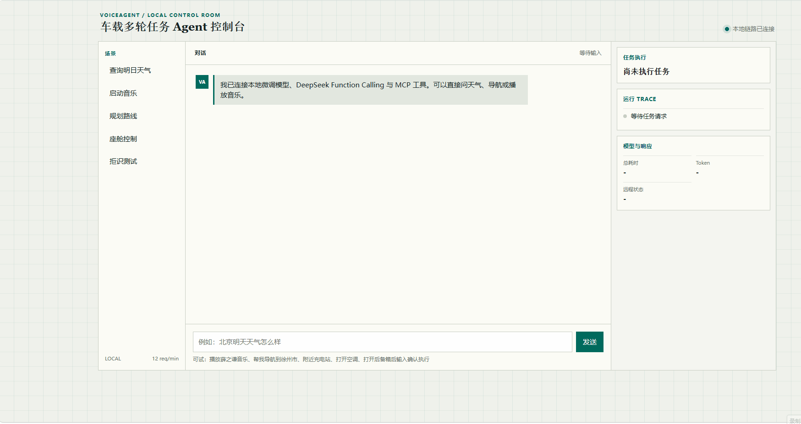
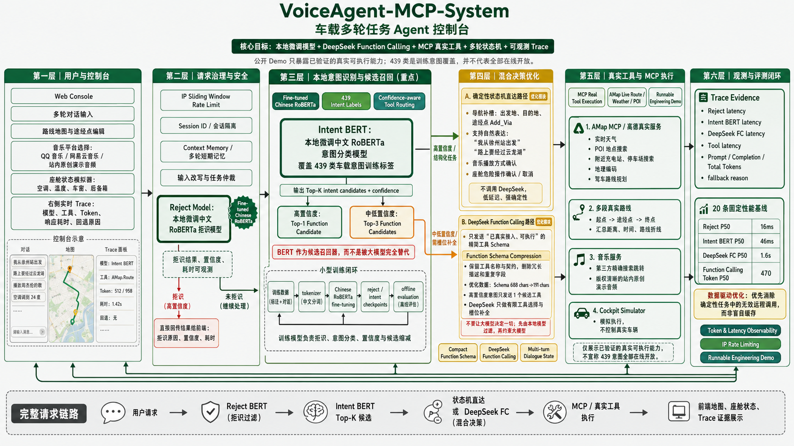

# 车载多轮任务 Agent 控制台

[](https://github.com/dingsleep/voiceagent-mcp-system/actions/workflows/ci.yml)

> 基于本地微调中文 RoBERTa、DeepSeek Function Calling、多轮状态机与 MCP 真实工具的车载任务型对话 Agent。



## 项目定位

这不是一个只靠提示词拼出来的聊天机器人。项目保留了完整的 NLU 模型训练与数据治理流程，并将微调模型、DeepSeek Function Calling、真实高德服务、多轮状态机和可观测 Trace 组合成可运行的车载 Agent 控制台。

- 本地微调中文 RoBERTa 负责拒识、意图召回、置信度计算和 Top-K 候选路由。
- DeepSeek Function Calling 只接收已验证可执行的精简工具 Schema，不接收无边界的工具列表。
- 导航补槽、途经点修改、音乐授权、座舱确认等确定性流程由本地状态机直接完成，避免无效远程调用。
- 通过高德 MCP 服务获得真实天气、POI、地理编码、附近服务和驾车路线。
- Web 控制台可展示模型/工具 Trace、Token、延迟、回退原因、路线地图和座舱模拟状态。

## 系统架构



## 核心亮点

### 1. 先完成模型训练，再完成工程落地

仓库保留了原始训练、数据审计、清洗、均衡训练与评测流程，而不是用一个玩具页面替代模型工作。

| 模型 | 测试集 Accuracy | Macro F1 | 其他指标 |
| --- | ---: | ---: | --- |
| 意图模型 `bert.clean-v1` | 86.17% | 82.76% | Top-3 96.03%，Top-5 97.23% |
| 均衡意图模型 `bert.clean-balanced-v1` | **87.79%** | **85.18%** | Top-3 97.04%，Top-5 97.92% |
| 拒识模型 `bert_tiny.clean-v1` | 89.09% | 88.69% | 验证集校准阈值 0.6162 |

- 意图模型覆盖 **439 类车载领域训练标签**，可输出 Top-K 候选及置信度。
- 训练流程审计重复 Query、冲突标签、训练/验证/测试泄漏和类别长尾问题。
- 在相同干净测试集上，均衡训练使 Macro F1 提升 **2.42 个百分点**。
- 公开 Demo 只暴露已验证可执行的能力；439 类表示训练意图覆盖，不夸大为 439 项真实可执行功能。

相关证据：[训练与评测说明](docs/training-and-evaluation.md)、[模型实验结果](docs/model-experiment-results.md)。

### 2. 本地模型优先的混合决策链路

```text
用户输入
  -> Reject BERT 拒识
  -> Intent BERT Top-K 意图召回
  -> 本地多轮状态机直达 或 受约束的 DeepSeek Function Calling
  -> MCP / 真实服务执行
  -> 返回可追踪的回复、地图、座舱状态与指标
```

| 路径 | 负责内容 | 工程价值 |
| --- | --- | --- |
| 多轮状态机 | 起点/终点补槽、`Add_Via` 途经点、音乐平台选择、座舱确认/取消 | 确定性强、低延迟、不浪费 LLM 调用 |
| DeepSeek Function Calling | 模糊任务解析、有限工具选择、槽位补全 | 保留自然语言理解能力，同时限制工具边界 |

例如下面的导航对话不需要把每一步都交给大模型：

```text
导航到徐州东站
我从徐州站出发
路上要经过云龙湖
```

Agent 会保存起点、终点与途经点，并重新请求真实驾车路线。系统在等待出发地时，也支持直接输入 `徐州站` 这样的裸地点。

### 3. 用意图模型约束 Function Calling，而不是被大模型替代

本地微调意图模型在这里承担的是**候选召回器**：

- 高置信度意图，例如 `0.996`：只发送 Top-1 可执行工具。
- 中低置信度意图：最多发送 Top-3 候选工具。
- 对遗留工具定义进行去重，并为公开 Demo 单独准备精简 Schema。
- 在不改动工具名称和执行契约的前提下，移除冗长描述、重复字段和未接入功能。

一次已验证的导航 Trace 将候选 Schema 从 **688 chars 压缩到 191 chars**，同时保留 `Go_POI` 的执行契约。

### 4. 真实工具执行，而不是伪造回复

| 能力 | 真实执行方式 |
| --- | --- |
| 天气查询 | 高德实时天气 MCP 工具 |
| 目的地 / POI 搜索 | 高德文本搜索 MCP 工具 |
| 附近充电站 / 停车场 | 浏览器定位或手动地点 + 高德周边搜索 |
| 驾车导航 | 高德地理编码 + 驾车路线 API + 路线折线渲染 |
| 添加途经点 | 真实多段路线：起点 -> 途经点 -> 终点 |
| 音乐播放 | 明确授权后跳转 QQ 音乐 / 网易云搜索，或播放版权清晰的站内演示音频 |
| 座舱控制 | 会话隔离的模拟执行，界面和 Trace 都明确标注“模拟” |

已真实验证路线：`徐州火车站 -> 云龙湖 -> 徐州东站`。系统返回两段驾车路线、总距离、预计时间与完整路线折线，并在地图中标记途经点。

### 5. 性能基线与运行证据

项目提供固定 20 条用例的真实链路评测，分别记录 Reject、Intent BERT、DeepSeek FC、工具调用耗时、输入/输出 Token、P50/P95 和远程回退率。

| 阶段 | 已记录的 P50 |
| --- | ---: |
| Reject BERT | 16 ms |
| Intent BERT | 46 ms |
| DeepSeek Function Calling | 1.6 s |
| Function Calling 总 Token | 470 |

这些数据直接驱动优化，而不是盲目加缓存。例如“打开空调”等确定性座舱命令已改为状态机直达，真实验证总耗时约 **31 ms**，不再调用 DeepSeek。

右侧 Trace 会展示：

- Reject 后端、置信度和耗时
- Intent BERT Top-K 与耗时
- Function Calling 候选数、Schema 体积、Token 和耗时
- 工具提供方、工具名与耗时
- 决策策略、多轮上下文和回退原因

## 本地运行演示

### 环境要求

- Python 环境：`tx_agent`
- GitHub 默认 Demo 不需要密钥即可验证基础链路。
- 高德真实工具和 DeepSeek 远程链路需要在本地 `.env` 中配置。

### 启动控制台

```bash
conda run -n tx_agent python -m voice_agent_mcp.api
```

浏览器打开 <http://127.0.0.1:8080/>。

可直接测试：

```text
播放薛之谦的音乐
导航到徐州东站
我从徐州站出发
路上要经过云龙湖
附近充电站
打开空调
温度再低一点
打开后备箱
确认执行
```

### 运行测试

```bash
conda run -n tx_agent python -m unittest discover -s tests -p "test_*.py"
```

### 运行 20 条真实链路基线

该命令会调用本地模型服务与已配置的远程 Provider，因此要求显式开启网络调用：

```bash
conda run -n tx_agent python -m eval.evaluate_demo ^
  --backend remote ^
  --allow-network ^
  --case-file eval/performance_cases.jsonl ^
  --report eval/reports/performance-baseline-local.json
```

## 接入本地模型与真实服务

复制模板后，仅在自己的电脑中填写密钥：

```bash
copy .env.example .env
```

随后按顺序启动：

```bash
conda run -n tx_agent python -m train.intent_infer
conda run -n tx_agent python -m function_call.chatnlu_infer
conda run -n tx_agent python -m voice_agent_mcp.api
```

`.env` 已被 Git 忽略。请勿提交 DeepSeek Key、高德 Key、Token、证书或私有模型权重；仓库仅保留含占位符的 `.env.example`。

## 项目结构

```text
voice_agent_mcp/       可运行 Web 控制台、混合 Agent、状态机、真实工具适配层
function_call/         Function Calling Schema、候选缩减、NLU 服务桥接
train/                 意图/拒识模型训练、推理与 checkpoint 选择逻辑
mcp_core/              面向高德服务的 MCP 工具与适配层
eval/                  离线评测与 20 条性能基线
tests/                 单元测试与集成回归测试
docs/                  架构、演示、实验结果与工程化说明
```

## 工程安全边界

- 使用 IP 滑动窗口限流，保护本地配置的 Provider 预算。
- 使用 Session ID 隔离座舱状态和多轮上下文。
- 天气、路线、POI、附近服务不作为长期模型缓存，避免展示过期真实数据。
- 远程 NLU 失败通过 `fallback_reason` 显式暴露，不隐藏降级路径。
- 座舱能力在工具层和 UI 中都明确为模拟执行，不控制真实车辆。

## 简历表述

**车载多轮任务 Agent 系统 | 微调中文 RoBERTa + DeepSeek Function Calling + MCP**

- 构建融合微调拒识/意图模型、置信度候选路由、确定性多轮状态机与 MCP 真实服务的车载任务 Agent。
- 通过数据审计、去重、防泄漏与均衡训练优化长尾意图识别，在均衡意图模型上取得 **87.79% Accuracy / 85.18% Macro F1**。
- 基于紧凑 Schema 和置信度候选缩减降低 Function Calling 输入开销，并在 Web 控制台中展示 Token、延迟、工具调用与回退证据。
- 接入高德实时天气、POI、附近服务、多段驾车路线与地图渲染；实现会话隔离的座舱模拟、音乐授权与 IP 限流。

## 说明

- 本仓库不训练或分发 ASR 模型，接收文本或上游 ASR 转写结果。
- 预训练权重、本地 checkpoint、`.env` 和本地生成的评测报告均不会进入版本控制。
- 进一步了解实现细节：[Demo 链路拆解](docs/demo-walkthrough.md)、[项目入口说明](docs/entrypoints.md)、[Schema 报告](docs/function-schema-report.md)。
