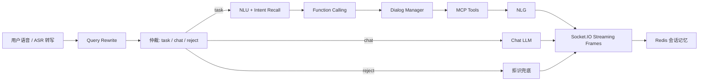

# VoiceAgent MCP System

[](https://github.com/dingsleep/voiceagent-mcp-system/actions/workflows/ci.yml)

> 仓库默认以无密钥的 `rule` 模式运行。保留的 BERT + Function Calling NLU 可在本地服务化后接入 Demo API；远程集成已使用 OpenAI-compatible DeepSeek endpoint 验证，并与确定性 Demo 评测分开统计。

面向车载场景的多轮任务型对话 Agent。项目覆盖从数据治理、BERT 意图识别与拒识，到 Query Rewrite、Function Calling、MCP 工具调用和流式响应的完整链路。

## 项目亮点

- **真实训练闭环**：基于约 66 万条原始样本构建意图识别和拒识训练流程；清洗后数据划分无跨集合文本重叠，避免数据泄漏导致的虚高指标。
- **可量化模型结果**：清洗后的均衡意图模型在测试集达到 **87.79% Accuracy / 85.18% Macro F1**，Top-3 准确率 **97.04%**；拒识模型达到 **89.09% Accuracy / 88.69% Macro F1**，并基于验证集校准拒识阈值。
- **面向长尾任务的工程治理**：提供重复 query、冲突标签、类别失衡和跨集合重叠审计；通过 balanced cross-entropy 将同一干净测试集上的意图 Macro F1 提升 **2.42 个百分点**。
- **可解释的工具编排**：Function Calling schema 被抽取为 448 个唯一工具、16 个领域分类，并提供重复项和 schema 校验报告，而不是把工具定义散落在业务代码中。
- **10 分钟可验证**：无密钥 Demo、HTTP API、离线评测、单元测试和 GitHub Actions CI 均可本地运行；完整生产链路仍保留，便于继续接入模型服务与 MCP 服务。

## 它解决什么问题

车载助手收到一句自然语言后，需要在一次会话内完成：

1. 识别任务、闲聊与无效输入。
2. 结合上下文补全“他的歌”“明天呢”等省略表达。
3. 识别 `intent`、`function` 和 `slots`，将自然语言转成结构化调用。
4. 调用天气、音乐、导航等 MCP 风格工具，再生成适合语音播报的结果。
5. 通过 Redis 维护会话记忆，并以 Socket.IO frame 流式返回中间过程与最终结果。

## 架构



## 模型与数据实验

原始数据审计发现重复 query、冲突标签和训练/验证/测试集合之间的文本重叠。因此项目保留原始数据不动，新增清洗数据集与可复现实验。

| 模型 | 测试 Accuracy | Macro F1 | 其他指标 |
| --- | ---: | ---: | --- |
| Intent `bert.clean-v1` | 86.17% | 82.76% | Top-3 96.03%, Top-5 97.23% |
| Intent `bert.clean-balanced-v1` | **87.79%** | **85.18%** | Top-3 97.04%, Top-5 97.92% |
| Reject `bert_tiny.clean-v1` | 89.09% | 88.69% | 校准阈值 0.6162 |

当前意图推理优先选择 `bert.clean-balanced-v1`，再回退到其他本地 checkpoint。实验环境、清洗规则、训练命令、产物管理与误差分析见 [模型实验结果](docs/model-experiment-results.md) 和 [训练与评估说明](docs/training-and-evaluation.md)。

## 快速开始

### 1. 无密钥 Demo

```bash
cd VoiceAgent-MCP-System
conda run -n tx_agent python -m voice_agent_mcp.cli --query "北京明天天气怎么样"
```

也可进入交互模式：

```bash
conda run -n tx_agent python -m voice_agent_mcp.cli
```

建议依次输入：

```text
北京明天天气怎么样
那上海呢
播放周杰伦的歌
他的歌还有哪些
给我讲个笑话
asdfghjkl
```

### 2. HTTP API

```bash
conda run -n tx_agent python -m voice_agent_mcp.api
```

```bash
curl -X POST http://127.0.0.1:8080/chat ^
  -H "Content-Type: application/json" ^
  -d "{\"query\":\"北京明天天气怎么样\",\"sender_id\":\"demo\"}"
```

接口同时接受上游语音识别的转写文本，使用 `transcript` 代替 `query` 即可；本仓库不训练 ASR 模型。

### 3. 可选接入完整 NLU 服务

默认 `rule` 模式不需要模型、Redis 或 API Key，适合快速演示。已有模型服务可通过远程后端接入：

```bash
conda run -n tx_agent python -m voice_agent_mcp.cli ^
  --nlu-backend remote ^
  --nlu-url http://127.0.0.1:8009/chatnlu-server/v1 ^
  --query "北京明天天气怎么样"
```

远程 NLU 使用已有的 `function_call/chatnlu_infer.py` 协议，后者可继续连接 BERT intent recall 与 Function Calling 服务。远程服务超时、返回格式异常，或返回当前 Demo 未实现的工具时，Agent 会自动降级到规则后端，并在最终 frame 的 `metadata` 中给出 `nlu_backend`、`fallback_reason`、`trace_id` 和耗时。这样本地 Demo 不会因为外部依赖不可用而失效。

### 4. 验证项目

```bash
conda run -n tx_agent python eval/evaluate_demo.py
conda run -n tx_agent python -m unittest discover -s tests
conda run -n tx_agent python scripts/check_project.py
```

`check_project.py` 会运行文本质量检查、发布检查、训练数据审计、Demo 评测、Function Calling schema 报告和单元测试。

远程链路评测需要显式授权网络调用，结果默认只写到本地忽略目录：

```bash
conda run -n tx_agent python eval/evaluate_demo.py ^
  --backend remote ^
  --allow-network ^
  --report eval/reports/remote-report.json
```

### 已验证的 DeepSeek 远程 NLU 路径

远程路径将密钥保留在被 Git 忽略的 `.env` 中。`API_KEY` 同时兼容裸 provider key 和带 `Bearer ` 前缀的值，两种形式都不得提交。复制 `.env.example` 后，可按以下方式配置 DeepSeek-compatible endpoint：

```dotenv
BASE_URL=https://api.deepseek.com/chat/completions
API_KEY=your-api-key
LLM_MODEL=deepseek-v4-flash
VOICE_AGENT_NLU_BACKEND=remote
VOICE_AGENT_NLU_URL=http://127.0.0.1:8009/chatnlu-server/v1
VOICE_AGENT_NLU_TIMEOUT=5
```

按意图识别服务、遗留 NLU 服务、Demo API 的顺序启动：

```bash
conda run -n tx_agent python -m train.intent_infer
conda run -n tx_agent python -m function_call.chatnlu_infer
conda run -n tx_agent python -m voice_agent_mcp.api
```

严格远程评测覆盖天气、音乐、导航和拒识分流。2026-07-14 在本地验证环境中，4/4 用例的端到端 intent/function/slot 均匹配；3 个任务用例均实际使用远程 NLU，P95 延迟为 3.1 秒。详细报告仅写入被 Git 忽略的 `eval/reports/`。

运行时会显式暴露远程降级，而不是掩盖它：最终 frame 包含 `nlu_backend`、`fallback_reason`、`trace_id` 和耗时。向 Provider 发起请求前，同名遗留工具 schema 会收敛为每个函数一份 canonical schema；原始 schema 不改动，保留给审计与后续治理。

报告分别记录端到端准确率、远程 NLU 成功率、降级原因分布和 P50/P95 延迟。默认 `rule` 评测和 GitHub Actions 不会调用外部模型服务。

## 仓库结构

| 路径 | 说明 |
| --- | --- |
| `voice_agent_mcp/` | 无密钥可运行的车载多轮 Agent 展示层，包含 rewrite、仲裁、NLU、工具调用、NLG 与流式 frame |
| `train/` | BERT 意图识别与拒识模型的训练、推理和 checkpoint 选择逻辑 |
| `scripts/` | 数据审计、数据清洗、发布检查和项目自检 |
| `function_call/` | Function Calling schema、槽位处理和对话管理 |
| `mcp_core/` | MCP Client / Server 与地图、音乐等工具服务 |
| `client/` | 原完整链路中的 Rewrite、仲裁、NLU、拒识客户端 |
| `eval/`、`tests/` | 离线 Demo 评测与单元测试 |
| `docs/` | 实验报告、入口说明、schema 报告和工程化记录 |

## Function Calling 治理

项目将原始 schema 集中加载、去重、分域并校验。当前目录中有 448 个唯一工具，覆盖导航、媒体、座椅、空调、车身控制、系统设置等 16 个领域。

```bash
conda run -n tx_agent python -m function_call.schema_catalog
```

详细结果见 [Schema 报告](docs/function-schema-report.md)，待治理问题见 [修复计划](docs/function-schema-remediation.md)。

## 完整链路与演示层

`start.py` 对应原完整 Socket.IO 网关，依赖 Redis、LLM API、NLU / Reject / Intent 服务和 MCP 服务。环境变量模板在 `.env.example`，检查命令如下：

```bash
copy .env.example .env
conda run -n tx_agent python scripts/check_env.py
```

`voice_agent_mcp/` 不替代完整链路。它的作用是让 GitHub 浏览者无需密钥和私有服务，就能先验证核心工作流；随后可阅读 [Demo 链路拆解](docs/demo-walkthrough.md)、[项目入口说明](docs/entrypoints.md) 和 [完整链路时序](docs/legacy-runtime-flow.md)。

## 模型权重

为避免提交大文件，预训练权重和本地 checkpoint 均在 `.gitignore` 中排除，例如：

```text
train/pretrained/**/pytorch_model.bin
train/saved/**/*.ckpt
*.safetensors
```

仓库保留训练代码、配置、词表、数据审计逻辑、运行命令和真实实验指标。需要复现训练时，将本地权重放回对应目录即可。

## 简历表述

**基于 LLM + MCP 的车载多轮任务型对话 Agent 系统**

- 设计车载多轮任务编排链路，集成 Query Rewrite、仲裁分流、拒识检测、NLU、Function Calling、MCP 工具调用与流式响应。
- 构建 BERT 意图识别与拒识训练闭环；针对数据泄漏、重复样本、冲突标签和类别长尾实现自动审计与清洗，使均衡训练 Macro F1 提升 2.42 个百分点。
- 将 448 个车载 Function Calling schema 统一去重、分类和校验，降低工具定义分散带来的维护风险。
- 提供无密钥演示层、HTTP API、离线评测、单元测试和 CI，使核心能力可在无私有服务环境下快速验证。
