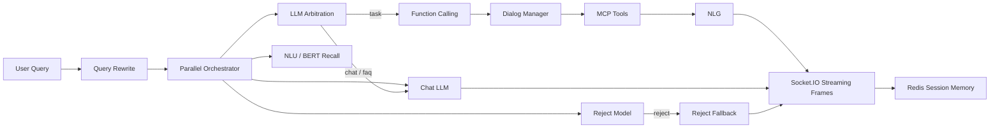

# VoiceAgent MCP System

[](https://github.com/dingsleep/voiceagent-mcp-system/actions/workflows/ci.yml)

一个面向车载语音场景的 **LLM + Agent + MCP 多轮任务型对话系统**。

这个仓库不是玩具 Demo，也不是课程源码原样堆上来。它保留了原项目的核心能力，并做了工程化整理：集中配置、Prompt 修复、Redis 降级、本地可跑 Demo、测试和文档，方便 GitHub 展示和面试讲解。

## 这个项目解决什么问题

用户在车载语音助手里说一句话，系统需要判断：

- 是任务型指令，还是闲聊 / FAQ / 噪声；
- 如果是任务，要识别 intent、function 和 slots；
- 如果需要外部数据，要通过 MCP 风格工具调用天气、地图、音乐等服务；
- 如果是多轮对话，要理解“他的歌”“明天呢”“再近一点”这类省略表达；
- 最终把结构化结果转换成适合语音播报的自然语言，并流式返回。

## 核心能力保留情况

| 能力 | 对应模块 | 状态 |
| --- | --- | --- |
| 主编排 / 网关 | `start.py`, `dialog.py` | 保留 |
| Query Rewrite | `client/rewrite.py` | 保留 |
| 仲裁分流 | `client/arbitration.py` | 保留 |
| 拒识检测 | `client/reject.py`, `train/reject_infer.py` | 保留 |
| NLU 语义理解 | `client/nlu.py`, `function_call/chatnlu_infer.py` | 保留 |
| Function Calling Schema | `function_call/function.py` | 保留 |
| 槽位处理 | `function_call/slot_process.py` | 保留 |
| DM 对话管理 | `function_call/dm/` | 保留 |
| MCP Client / Server | `mcp_core/` | 保留 |
| BERT 意图 / 拒识训练 | `train/` | 保留 |
| benchmark 脚本 | `test/` | 保留 |
| 无密钥可跑 Demo | `voice_agent_mcp/` | 新增 |
| 单元测试 | `tests/` | 新增 |

详细优化记录见 [docs/optimization-notes.md](docs/optimization-notes.md)。

## 架构



## 10 分钟跑起来

默认先跑无密钥 Mock Demo。它不依赖大模型、不依赖 Redis、不依赖外部 API，用来验证项目主链路。

```bash
cd VoiceAgent-MCP-System
python -m voice_agent_mcp.cli --query "北京明天天气怎么样"
```

交互模式：

```bash
python -m voice_agent_mcp.cli
```

可测试输入：

```text
北京明天天气怎么样
那上海呢
播放周杰伦的歌
他的歌还有哪些
给我讲个笑话
asdfghjkl
```

启动 HTTP Demo：

```bash
python -m voice_agent_mcp.api
```

请求：

```bash
curl -X POST http://127.0.0.1:8080/chat ^
  -H "Content-Type: application/json" ^
  -d "{\"query\":\"北京明天天气怎么样\",\"sender_id\":\"demo\"}"
```

运行测试：

```bash
python -m unittest discover -s tests
```

发布前自检：

```bash
python scripts/check_project.py
```

检查 GitHub 可见文本是否有明显乱码：

```bash
python scripts/check_text_quality.py --strict
```

检查是否适合上传 GitHub：

```bash
python scripts/check_release.py --strict
```

运行 Demo 离线评测：

```bash
python eval/evaluate_demo.py
```

查看 Function Calling schema 概览：

```bash
python -m function_call.schema_catalog
```

当前 schema 统计见 [docs/function-schema-report.md](docs/function-schema-report.md)。
治理计划见 [docs/function-schema-remediation.md](docs/function-schema-remediation.md)。
Demo 链路拆解见 [docs/demo-walkthrough.md](docs/demo-walkthrough.md)。
项目入口说明见 [docs/entrypoints.md](docs/entrypoints.md)。
原完整链路时序见 [docs/legacy-runtime-flow.md](docs/legacy-runtime-flow.md)。
Class 映射缺口见 [docs/function-class-mapping-plan.md](docs/function-class-mapping-plan.md)。

## 运行原完整链路

原完整链路依赖 Redis、LLM API、NLU / Reject / Intent 服务和 MCP 工具服务。

1. 复制环境变量：

```bash
copy .env.example .env
```

检查环境变量：

```bash
python scripts/check_env.py
```

2. 配置 `.env`：

```text
API_KEY=Bearer your-api-key
BOT_URL=https://your-openai-compatible-endpoint
NLU_URL=http://127.0.0.1:8009/chatnlu-server/v1
REJECT_URL=http://127.0.0.1:8007/reject-server/v1
INTENT_URL=http://127.0.0.1:8008/intent-server/v1
AMAP_MAPS_API_KEY=your-amap-key
```

3. 安装原链路依赖：

```bash
pip install -r requirements-runtime.txt
```

4. 启动网关：

```bash
python start.py
```

## 大模型权重说明

为了适合 GitHub 上传，本仓库没有提交这些大文件：

- `train/pretrained/**/pytorch_model.bin`
- `train/saved/**/*.ckpt`
- `*.pth`
- `*.safetensors`

保留了训练代码、配置、vocab 和数据目录。权重文件建议通过 HuggingFace、网盘、GitHub Release 或 Git LFS 管理。

训练命令、评估指标和模型产物管理见 [docs/training-and-evaluation.md](docs/training-and-evaluation.md)。

已完成的 GPU 训练实验、测试指标和复现命令见 [docs/model-experiment-results.md](docs/model-experiment-results.md)。

训练数据类别覆盖和长尾分布可用 `python scripts/check_training_data.py` 审计。

## 为什么加 `voice_agent_mcp/`

原完整链路需要多个私有服务和 API Key，面试官很难立即跑起来。所以新增了一个零依赖工程入口：

- 展示同一套链路思想：rewrite -> arbitration -> NLU -> tool -> NLG -> stream；
- 不替代原模块，只作为“可运行展示层”；
- 后续可以逐步把 mock 组件替换成原来的 `client/`, `function_call/`, `mcp_core/`, `train/`。

## 简历写法

**基于 LLM + MCP 的车载多轮任务型对话 Agent 系统**

- 设计多轮对话编排链路，集成 Query Rewrite、LLM 仲裁、拒识检测、NLU、Function Calling、MCP 工具调用和流式响应。
- 使用 Redis 管理短期会话记忆，支持多轮省略句和指代消解，提升任务型语义识别稳定性。
- 构建 BERT 意图识别与拒识模型训练 / 推理流程，支持离线 benchmark 和端到端准确率评估。
- 封装天气、地图、音乐等能力为 MCP 工具服务，实现自然语言到结构化工具调用再到自然语言播报的闭环。
- 补充 Mock Demo、HTTP API、单元测试和工程文档，使项目在无私有服务环境下也能快速演示。
