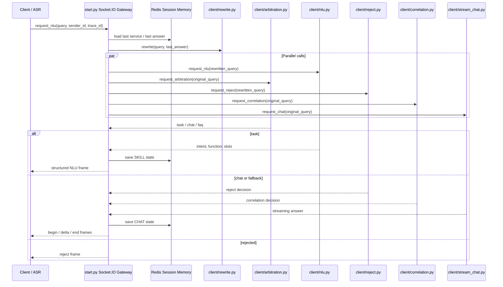

# Legacy Runtime Flow

这份文档说明原完整链路的运行时序。`voice_agent_mcp/` 是无外部依赖的展示层，`start.py` 是保留下来的 Socket.IO 网关主入口。

## Runtime Sequence



## Key Decisions

| Decision | Implementation | Why it matters |
| --- | --- | --- |
| Query rewrite before NLU | `client/rewrite.py` | 处理“那上海呢”这类多轮省略表达 |
| Parallel service calls | `ThreadPoolExecutor` in `start.py` | 并行调用 arbitration、NLU、reject、correlation、chat，降低端到端等待 |
| Arbitration first | `client/arbitration.py` | 决定走任务型 NLU 还是闲聊兜底 |
| Redis short-term memory | `utils/redis_tool.py` | 保存 last service 和 chat history，并带 TTL |
| Streaming chat frames | `client/stream_chat.py` + `send_msg()` | 贴近语音助手流式播报体验 |

## Required Services

| Service | Env vars | Notes |
| --- | --- | --- |
| LLM endpoint | `BASE_URL`, `API_KEY`, `BOT_URL`, `LLM_MODEL` | OpenAI-compatible chat/completions endpoint |
| Socket.IO gateway | `FLASK_SERVER_PORT` | `start.py` 默认使用 `8080` |
| Client entry URL | `ENTRY_URL` | 被 `dialog.py` 和 `examples/legacy/socketio_multi_turn_smoke.py` 使用 |
| NLU service | `NLU_URL` | 默认 `http://127.0.0.1:8009/chatnlu-server/v1` |
| Reject service | `REJECT_URL` | 默认 `http://127.0.0.1:8007/reject-server/v1` |
| Intent service | `INTENT_URL` | 默认 `http://127.0.0.1:8008/intent-server/v1` |
| Redis | `REDIS_HOST`, `REDIS_PORT`, `REDIS_DB` | Redis 不可用时会降级到内存存储 |

## Preflight

```bash
python scripts/check_env.py
python scripts/check_env.py --strict
python scripts/check_project.py
```
